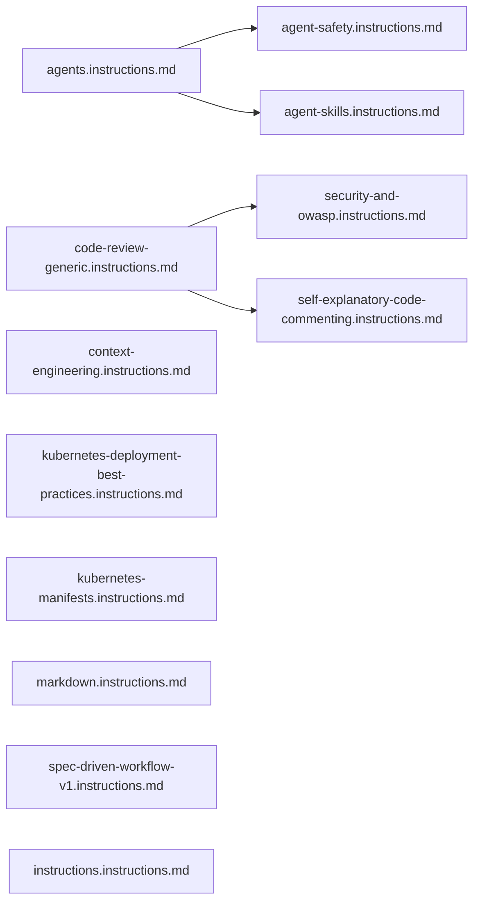

<!-- Auto-generated by /init-ahnlab | Date: 2026-05-20 -->
# 아키텍처 개요

## 전체 구조

AhnLab Copilot Configuration Kit은 **배포 패키지 → 배포 실행 → 프로젝트 적용** 세 단계로 구성됩니다.

```mermaid
flowchart TD
    subgraph 배포패키지["배포 패키지 (c:\\CodeTemp)"]
        T[templates/awesome-copilot-main/] --> A[agents/ 20개]
        T --> I[instructions/ 12개]
        T --> S[skills/ 10개]
        T --> P[plugins/ 9개]
        TPL[templates/AHNLAB_TEMPLATE_*.md] --> CFG[CFG 생성용 기반 템플릿]
        PR[prompts/init-ahnlab.prompt.md] --> CMD[/init-ahnlab 커맨드]
    end

    subgraph 배포실행["배포 실행 (/init-ahnlab)"]
        PH0[Phase 0: 프로젝트 문서 스캔]
        PH1[Phase 1: 에이전트 복사]
        PH15[Phase 1.5: Skills 복사]
        PH16[Phase 1.6: Plugins 복사]
        PH2[Phase 2: Instructions 복사]
        PH3[Phase 3: CFG 파일 생성]
        PH35[Phase 3.5: 문서 자동 생성]
        PH4[Phase 4: AGENTS.md 생성]
        PH5[Phase 5: 감사 검증]
        PH0 --> PH1 --> PH15 --> PH16 --> PH2 --> PH3 --> PH35 --> PH4 --> PH5
    end

    subgraph 프로젝트적용[".github/ 산출물"]
        GA[.github/agents/]
        GI[.github/instructions/]
        GS[.github/skills/]
        GP[.github/plugins/]
        GC[.github/copilot-instructions.md]
        GCS[.github/code-style-guide.md]
        GCM[.github/commit-message.style.md]
        GD[.github/docs/]
        AG[AGENTS.md]
    end

    배포패키지 --> 배포실행
    배포실행 --> 프로젝트적용
```

## 계층 구조

```
레이어 1: 원본 소스 (templates/awesome-copilot-main/)
    └── 절대 수정 금지, 배포 무결성 보장

레이어 2: 배포 실행 (prompts/init-ahnlab.prompt.md)
    └── 소스 복사 + 프로젝트 맞춤 추가 + CFG 생성

레이어 3: 배포 결과물 (.github/)
    └── 프로젝트별 Copilot 설정 (에이전트/인스트럭션/CFG/문서)
```

## 컴포넌트 관계

### 에이전트 (Agents)

20개 에이전트 파일은 역할에 따라 분류됩니다.

| 카테고리 | 에이전트 |
|----------|----------|
| 아키텍처 | `arch.agent.md`, `context-architect.agent.md`, `se-system-architecture-reviewer.agent.md` |
| 개발 | `gem-implementer.agent.md`, `gem-planner.agent.md`, `gem-orchestrator.agent.md` |
| 품질/리뷰 | `gem-reviewer.agent.md`, `devils-advocate.agent.md`, `janitor.agent.md` |
| 보안 | `se-security-reviewer.agent.md` |
| 문서 | `gem-documentation-writer.agent.md`, `prd.agent.md`, `specification.agent.md` |
| DevOps | `devops-expert.agent.md`, `gem-devops.agent.md` |
| 기타 | `gem-researcher.agent.md`, `task-planner.agent.md`, `tech-debt-remediation-plan.agent.md`, `ultimate-beast-mode.agent.md`, `gem-browser-tester.agent.md` |

### 인스트럭션 (Instructions)

12개 인스트럭션 파일은 Copilot이 코드 작성 시 참조하는 규칙입니다.



## 데이터 흐름

```
사용자 → /init-ahnlab 실행
    → Phase 0: doc/docs 폴더 스캔 (없으면 경고 후 계속)
    → Phase 1-1.6: 소스 파일 복사 (원본 보존 + 맞춤 추가)
    → Phase 2: 인스트럭션 복사 (원본 보존 + 맞춤 추가)
    → Phase 3: AHNLAB_TEMPLATE_*.md → .github/*.md (플레이스홀더 치환)
    → Phase 3.5: 소스 분석 → .github/docs/*.md 자동 생성
    → Phase 4: .github/docs/ 스캔 → AGENTS.md 생성 + 문서 참조 테이블
    → Phase 5: 완결성 검증 → AUDIT_REPORT_YYYY-MM-DD.md
```
